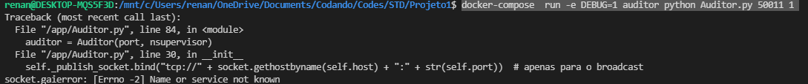

## Captura de bandeiras com robôs autônomos

<!--ts-->
   * [Descrição](#Descrição)  
   * [Criando as imagens com o Docker](#Criando-as-imagens-com-o-Docker)
   * [Executando a aplicação com Docker run](#Executando-a-aplicação-usando-o-Docker-run)
   * [Criando as imagens com o Docker-Compose](#Criando-as-imagens-com-o-Docker-Compose)

<!--te-->

### Descrição 

### Criando as imagens com o Docker

Para construir as imagens do auditor, supervisor e do robo respectivamente, estando na pasta raiz, é necessário os seguintes comandos.

```shel
    docker build -t std/auditor auditor/
    docker build -t std/supervisor supervisor/
    docker build -t std/robo robo/
```

### Executando a aplicação usando o Docker run

Nesse exemplo, foi criado uma rede chamada rede-std com driver bridge.

```shell
docker network create --driver bridge rede-std
```

Necessáro iniciar primeiro o Container do auditor, a porta e a quantidade de supervisores estão no argumento do Dockerfile da pasta auditor.

```shell
docker run -it --rm --name auditor --network rede-std std/auditor
```
Após subir o auditor, pode subir o supervisor e robo. Caso precise alterar a porta, estão nos Dockerfile das respectivas pastas

```shell
docker run -it --rm --name supervisor --network rede-std std/supervisor
```
```shell
docker run -it --rm --name robo --network rede-std std/robo
```
### Criando as imagens com o Docker-compose

Para compilar os containeres usando o compose basta estar na pasta raiz 

```shell
docker-compose build
```

Usando o compose é necessário subir inicialmente o auditor com:

```shell
docker-compose up auditor
```

Após pode subir o resto com:

```shell
docker-compose up
```

ou se prefesir, pode subir primeiro o supervisor e depois o robo

```shell
docker-compose up supervisor
docker-compose up robo
```

### Problemas que estão acontecendo

Quando subo docker-compose não está acontecendo nada... Fica no attaching

Quando tento executar com ele aparentemente executa, mas não encontra a rede.

```shell
docker-compose  run -e DEBUG=1 auditor python Auditor.py 50011 1
```

<div style="text-align:center">
   
</div>
