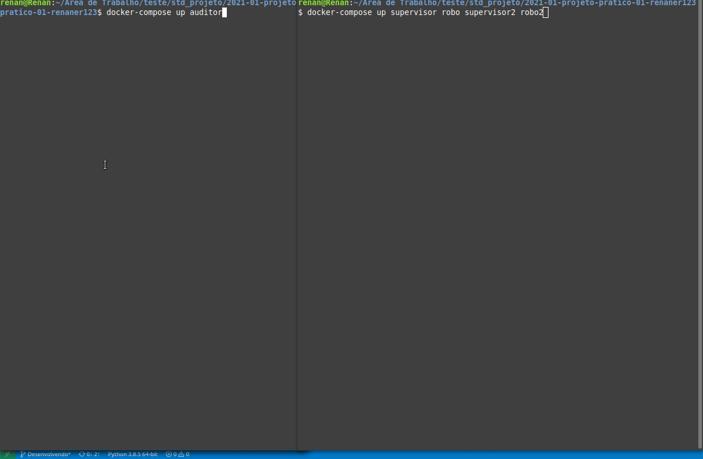

## Captura de bandeiras com robôs autônomos

<!--ts-->
   * [Projeto proposto](#Projeto-proposto-e-solução)
   * [Funcionalidades implementadas](#Funcionalidades-implementadas)  
   * [Criando as imagens com o Docker-Compose e executando](#Criando-as-imagens-com-o-Docker-Compose)
   * [Arquivo docker-compose](#Docker-compose)
   * [Demonstração do projeto em execução](#Demonstração-do-projeto-em-execução)
   * [Usando a aplicação somente com Dockerfile](#Criando-as-imagens-com-o-Docker)
<!--te-->

### Projeto proposto

O projeto proposto pode ser visto neste [arquivo](img/projeto1.pdf).

### Funcionalidades implementadas

- [x] Solução desenvolvida em Python3
- [x] Desenvolvida usando ZMQ(pyzmq)
- [x] Usa o serviço de descobertas de nomes do Docker
- [x] Containeres Docker
- [x] Arquivo docker-compose.yml 
- [x] Comunicação explicita entre sistemas
- [x] Não possuem IPs estáticos
- [x] Sistema auditor recebe a quantidade de supervisores por argumento
- [x] O sistema supervidor e o robô explorador imprimem em seu console as trocas e mensagens
- [x] Simulação do robô é simulado, possui um sleep com tempo randômico após cada movimentação
- [x] Sistema auditor  envia o total de bandeiras que cada equipe conseguiu capturar
- [x] Sistema auditor imprime o vencedor


### Criando as imagens com o Docker-compose

Para compilar os containeres usando o compose basta estar na pasta raiz 

```docker
docker-compose build
```

Usando o compose é necessário subir inicialmente o auditor com:

```docker
docker-compose up auditor
```

Após pode subir o resto com:

```docker
docker-compose up
```

Nesse caso, o resto consiste em dois supervisores(supervisor e supervisor2) e dois robos(robo e robo2). Caso queira garantir que os serviços irão subir na ordem correta e sem conflitar, pode-se executar da seguinte maneira

```docker
   docker-compose up supervisor robo supervisor2 robo2
```

### Docker compose

No arquivo docker-compose.yml estão sendo instanciados os serviços dos containers do auditor, supervisor e do robo. No auditor, deve-se informar a porta em que o container ficará ouvindo os sockets do supervisor, o número de bandeiras e o número de supervisores que serão conectados, conforme exemplo abaixo:

```docker
   command: python Auditor.py 50011 3 2
```

No supervisor, é necessário informar a porta de escuta do auditor, o nome que a rede do supervisor terá e a porta que utilizará para fazer o bind com seu robo, conforme exemplo abaixo:

```docker
  command: python Supervisor.py 50011 supervisor 50015
```
O supervisor permite ter mais de um, então para criar um novo supervisor é só criar outro serviço com o nome desejado e a porta de bind para o robo, conforme consta no arquivo [docker-compose.yml](docker-compose.yml)

O serviço robo, assim como o supervisor, permite criar mais de um. No caso, cada supervisor terá o seu robo, portando deverá usar como argumentos o nome do supervidor e a porta que ele estará ouvindo, conforme abaixo:

```docker
   command: python Robo.py 50015 supervisor
```
### Demonstração do projeto em execução




### Criando as imagens com o Docker

Caso queira usar os serviços usando os Dokerfile, é necessário descomentar o CMD nos respectivos arquivos. Para construir as imagens do auditor, supervisor e do robo estando na pasta raiz, é necessário os seguintes comandos.

```docker
    docker build -t std/auditor auditor/
    docker build -t std/supervisor supervisor/
    docker build -t std/robo robo/
```

Nesse exemplo, foi criado uma rede chamada rede-std com driver bridge.

```docker
docker network create --driver bridge rede-std
```

Necessáro iniciar primeiro o Container do auditor, informando a porta e a quantidade de supervisores que o auditor terá. Isso é passado no arquivo do Dockerfile na pasta auditor na camada CMD.

```docker
docker run -it --rm --name auditor --network rede-std std/auditor
```
Após subir o auditor, pode subir o supervisor e robo. Caso precise alterar a porta, estão nos Dockerfile das respectivas pastas

```docker
docker run -it --rm --name supervisor --network rede-std std/supervisor
```
```docker
docker run -it --rm --name robo --network rede-std std/robo
```
